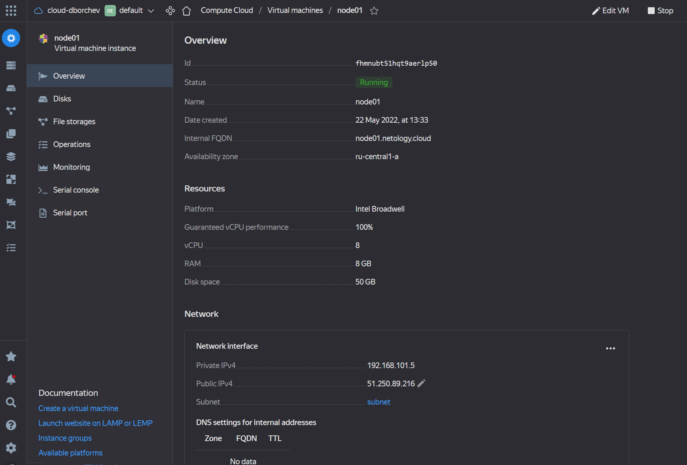
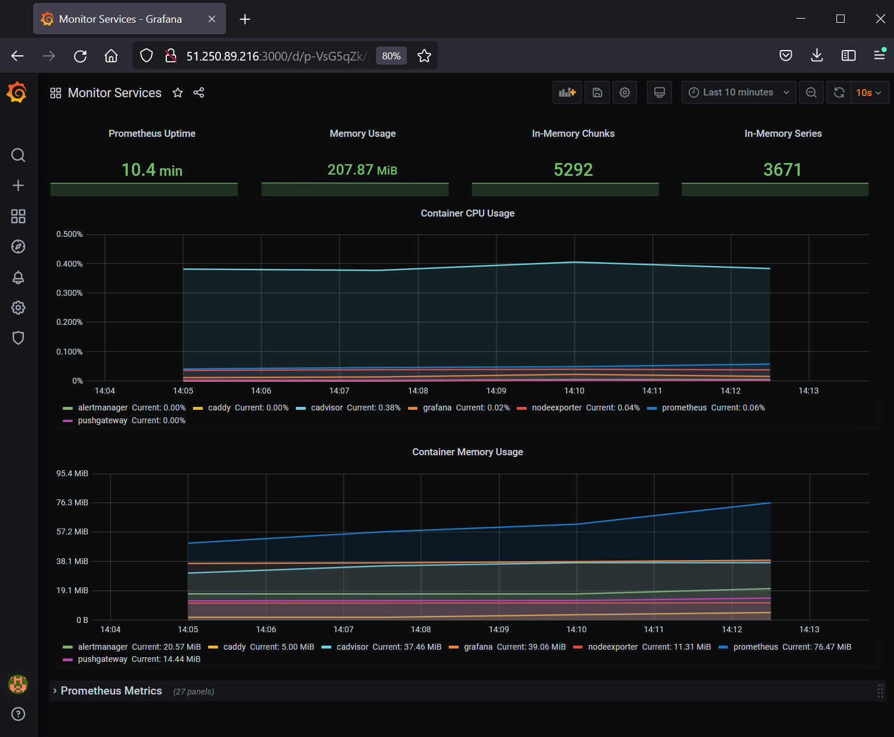
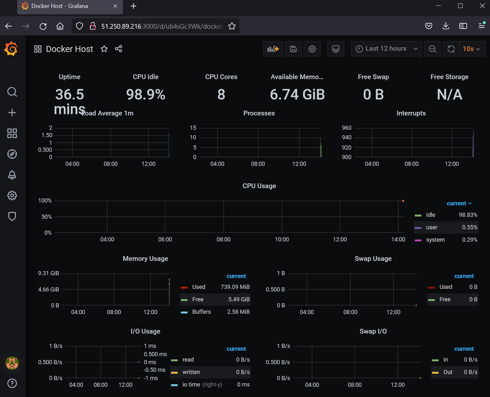

# Домашнее задание к занятию "5.4. Оркестрация группой Docker контейнеров на примере Docker Compose"

https://github.com/netology-code/virt-homeworks/blob/virt-11/05-virt-04-docker-compose/README.md

## Задача 1

Создать собственный образ операционной системы с помощью Packer.

>Для получения зачета, вам необходимо предоставить:
>- Скриншот страницы, как на слайде из презентации (слайд 37).

На слайде 37 -- пример вывода ansible, а не скриншот. Наверное, имели ввиду слайд 32 с образом.


```bash
$ yc compute image list
+----------------------+---------------+--------+----------------------+--------+
|          ID          |     NAME      | FAMILY |     PRODUCT IDS      | STATUS |
+----------------------+---------------+--------+----------------------+--------+
| fd85tmg0boo0eo5lm2o0 | centos-7-base | centos | f2e99agij1uhrk2ioilk | READY  |
+----------------------+---------------+--------+----------------------+--------+
```

## Задача 2

Создать вашу первую виртуальную машину в Яндекс.Облаке.

>Для получения зачета, вам необходимо предоставить:
>- Скриншот страницы свойств созданной ВМ



```bash
$ yc compute instance list
+----------------------+--------+---------------+---------+---------------+---------------+
|          ID          |  NAME  |    ZONE ID    | STATUS  |  EXTERNAL IP  |  INTERNAL IP  |
+----------------------+--------+---------------+---------+---------------+---------------+
| fhmnubt51hqt9aerlp50 | node01 | ru-central1-a | RUNNING | 51.250.89.216 | 192.168.101.5 |
+----------------------+--------+---------------+---------+---------------+---------------+
```

## Задача 3

Создать ваш первый готовый к боевой эксплуатации компонент мониторинга, состоящий из стека микросервисов.

Для получения зачета, вам необходимо предоставить:
- Скриншот работающего веб-интерфейса Grafana с текущими метриками






```bash
  ctop - 12:22:00 UTC   7 containers

     NAME                           CID          CPU             MEM             NET RX/TX       IO R/W          PIDS UPTIME

   ⏵ alertmanager                   96806a579f20        0%           21M / 8G    68K / 547K      0B / 1K         18   18m34s            ⏵ caddy                          0aaab712cb25        0%            6M / 8G    22M / 23M       0B / 0B         17   18m34s
 ☼ ⏵ cadvisor                       8babc0a30e1a        0%           40M / 8G    242K / 11M      0B / 0B         23   18m35s
   ⏵ grafana                        29bcb047a528        0%           40M / 8G    504K / 22M      0B / 13M        14   18m35s
   ⏵ nodeexporter                   94685d9d6dd1        0%           14M / 8G    113K / 2M       0B / 0B         20   18m34s
   ⏵ prometheus                     218036c9f6c2        0%           71M / 8G    14M / 604K      0B / 0B         19   18m34s
   ⏵ pushgateway                    2cbb79b4b4fc        0%           18M / 8G    43K / 189K      0B / 0B         14   18m34s
```
