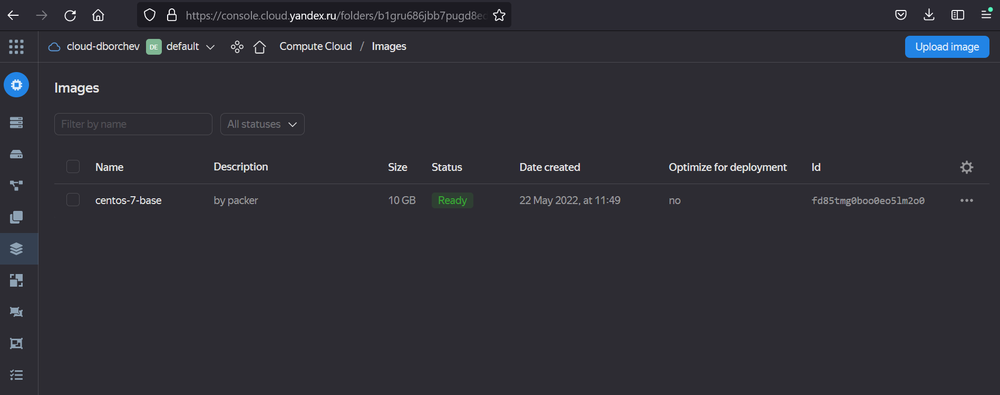

# Домашнее задание к занятию "5.4. Оркестрация группой Docker контейнеров на примере Docker Compose"

https://github.com/netology-code/virt-homeworks/blob/virt-11/05-virt-04-docker-compose/README.md

## Задача 1

Создать собственный образ операционной системы с помощью Packer.

>Для получения зачета, вам необходимо предоставить:
>- Скриншот страницы, как на слайде из презентации (слайд 37).

На слайде 37 -- пример вывода ansible, а не скриншот. Наверное, имели ввиду слайд 32 с образом.



```bash
$ yc compute image list
+----------------------+---------------+--------+----------------------+--------+
|          ID          |     NAME      | FAMILY |     PRODUCT IDS      | STATUS |
+----------------------+---------------+--------+----------------------+--------+
| fd85tmg0boo0eo5lm2o0 | centos-7-base | centos | f2e99agij1uhrk2ioilk | READY  |
+----------------------+---------------+--------+----------------------+--------+
```

