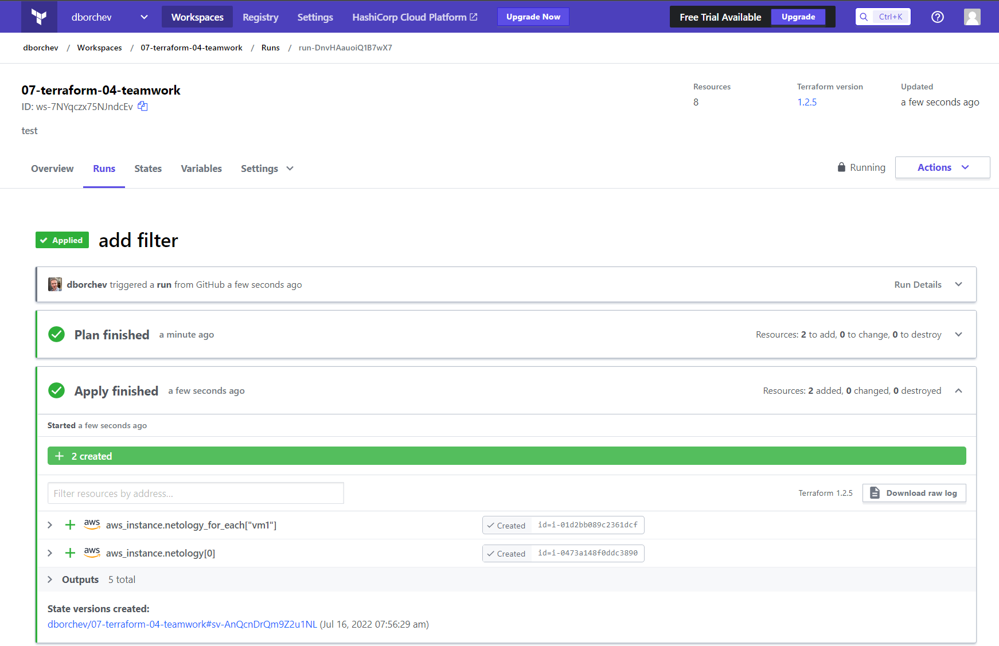

# Домашнее задание к занятию "7.4. Средства командной работы над инфраструктурой."

https://github.com/netology-code/virt-homeworks/blob/virt-11/07-terraform-04-teamwork/README.md

## Задача 1. Настроить terraform cloud
1. Зарегистрируйтесь на [https://app.terraform.io/](https://app.terraform.io/) ✅ 
2. Создайте в своем github аккаунте (или другом хранилище репозиториев) отдельный репозиторий с
 конфигурационными файлами прошлых занятий ✅ 
   1. https://github.com/dborchev/07-terraform-04-teamwork
3. Зарегистрируйте этот репозиторий в [https://app.terraform.io/](https://app.terraform.io/). ✅ 
4. Выполните plan и apply. ✅ 

В качестве результата задания приложите снимок экрана с успешным применением конфигурации.

## Задача 2. Написать серверный конфиг для атлантиса. 
1. Создай `server.yaml`
   1. https://github.com/dborchev/devops-netology/blob/main/teraform/server.yaml
2. Создай `atlantis.yaml`
   1. https://github.com/dborchev/devops-netology/blob/main/teraform/atlantis.yaml
